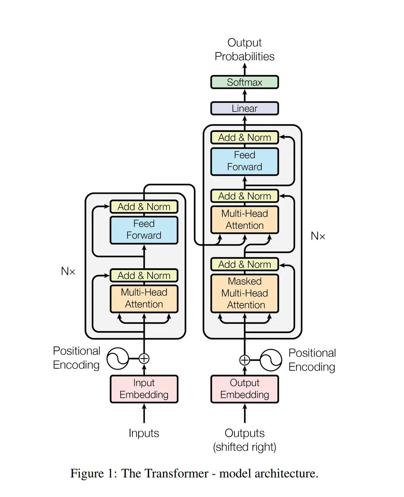
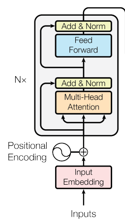
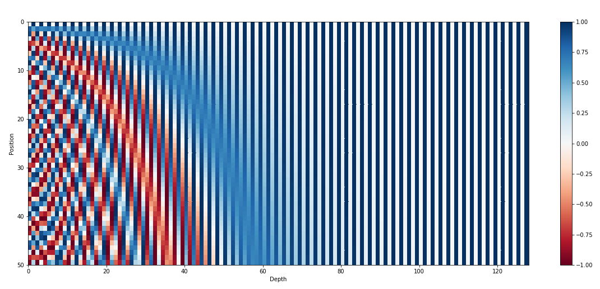
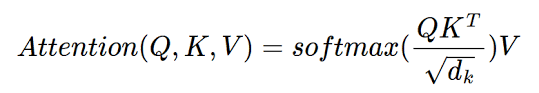
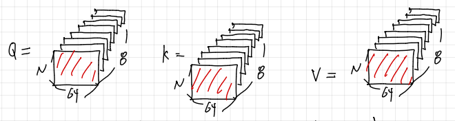
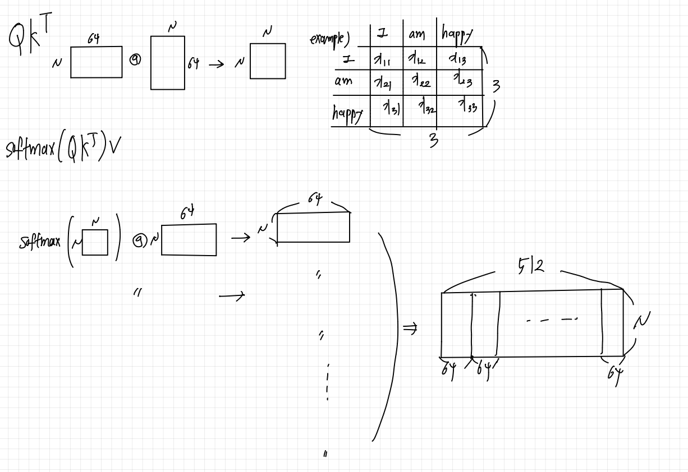
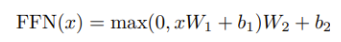
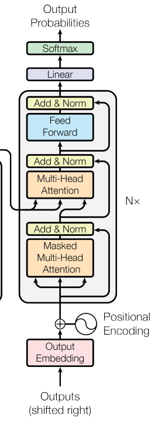
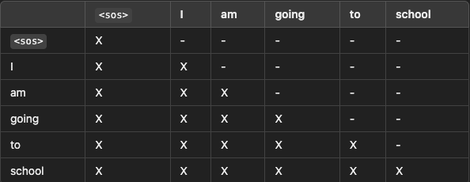

# Attention Is All You Need

> 해당 논문에서는 최초로 Self Attention 구조만을 사용하여 기계번역을 구현하였습니다. RNN 구조를 갖고 있지 않기 때문에 거리가 먼 x에 대해서도 모두 동일한 연산량으로 계산할 수 있어 계산의 효율성을 높히면서도 높은 성능을 보여주었습니다.

## Transformer의 구조

## Transformer 구조 설명

Transformer는 크게 Encoder Decoder 구조로 구성되어있습니다. 

> Encoder

#### [ Input Data ]
Encoder에서는 우선 데이터를 Embedding하게 됩니다.

예를들어 입력 데이터가 "I am happy " 라는 입력이 들어오면 Encoder에서 해당 데이터를 우선 **Token 단위** 로 데이터를 분할하게 됩니다. 예를 들어서 단어 단위로 Token을 분할하게 되면  Token = ['I', 'am', 'happy'] 이 됩니다.

이후 각 Token들에 대해서 특정 차원 D_model 으로 임베딩 하게 됩니다.
예를들어 D_model = 3 인경우 
Token = [[1, 0, 0], [0, 1, 0], [0, 0, 1]] 이런식으로 Embedding이 되게 됩니다.
해당 논문에서는 D_model = 512로 임베딩하였다고 합니다.

그렇다면 Token의 수가 N 개이고 D_model = 512 로 입력 데이터를 임베딩 하는경우 N * 512 크기의 Matrix를 얻게 됩니다. 이것이 바로 Transformer의 Input 데이터가 됩니다.

하지만 Sequence 데이터에서 " 내가 너를 때린다 " VS "너가 나를 떄린다 " 처럼 각 단어의 순서가 중요한 경우가 존재합니다. 그렇기에 각 데이터의 순서에 대한 정보를 입력해줄 필요가 있습니다.

그래서 해당 논문에서는 Positional Encoding값을 더해줌으로써 각 Token의 위치 정보를 추가해주게 됩니다. 이때 Positional Encoding 값 또한 N * 512 크기가 됩니다. 

결국 Token Embedding = T, Positional Encoding = P 라고 하였을때 둘다 N * 512 크기를 갖게 되므로 단순히 T + P 계산을 통해서 하나의 Matrix를 만들게 됩니다.

#### [ Attention ]
위에서 만든 N * 512 크기의 행렬을 Input이 Encoder의 Attention Module에 들어가게 됩니다.

Attention 구조에서는 데이터를 Q, K, V 행렬로 분할하여 계산하게 됩니다.

위의 수식과 같이 Attention이 계산되는데, 이때 필요한 것이 바로 Q, K, V 값입니다. 이 값을 만들기 위해서 W_iq, W_ik, W_iv 라는 가중치 행렬을 두게 됩니다.

(**해당 설명에서는 Multi Head의 개념으로 설명하겠습니다, Multihead를 사용하는 이유는 서로다른 가중치를 사용함으로써 보다 다양한 Insight를 얻을수 있기 때문입니다.**)

Multi Head = 8인경우 보통 dim = d_model / head 로 결정되기 때문에 예시에서는 dim = 512/ 8 = 64 차원으로 가중치 행렬의 차원을 결정하겠습니다.

즉, Q를 만들기 위한 W_iq의 경우 W_1q, W_2q ..... W8_q 까지 8개의 가중치가 필요하며 최종적으로 Q,K,V를 위해서는 24개의 행렬의 필요하게 됩니다. 각 행렬의 크기는 [512 * 64]가 됩니다.

아무튼, 각 행렬을 Encoder의 Input과 행렬곱을 하게 됩니다. 그러면 [ N * 512 ] @ [ 512 * 64 ] 를 통해서 최종적으로 [ N * 64 ] 크기의 Q, K, V가 각각 8개씩 만들어 지게 됩니다.

최종적으로 정리해보면 다음과 같이 각 8개씩 [ N * 64 ] 크기의 Q, K, V가 생성되게 됩니다. 그리고 이해를 돕기 위해서 가장 앞에 있는 Q, K, V 만을 사용해서 설명해보도록 하겠습니다. ( 어차피 모두 동일하게 작동하기에 마지막에 concat하면 되기에 )

이제 Q, K, V에 대해 구했으니 위의 공식에 맞게 계산을 하게 됩니다. 가장 먼저 Q @ K.T를 진행하게 됩니다. 이를 통해서 [ N * 64] @ [ 64 * N ] = [ N * N ]의 행렬을 얻게 되는데, 해당 행렬이 의미하는것은 각 토큰들 끼리의 유사도(연관성) 을 나타내게 됩니다. 위에서 들었던 예시를 생각해보면 3 * 3에서 각 I 와 am, happy의 유사도를 구하게 된다고 생각하면 됩니다.

그리고 dim이 크게 되면 자연스럽게 값이 너무 커지기 때문에 sqrt(D_model) 값으로 나눠주어 너무 큰 값이 되지 않도록 정규화를 진행해 줍니다.

그리고 softmax()를 진행하여 상대적인 유사도를 파악하게 됩니다. 이렇게 되면 서로 연관성이 높은 토큰들의 값이 높고, 그렇지 않으면 작은 값을 갖게 됩니다. 

이후 각 토큰의 정보인 V에 곱해 줌으로써, 각 토큰 정보에 **가중치**를 부여하여 더 중요한 토큰의 정보가 반영되고 덜 중요한 단어는 영향을 덜 받게 됩니다.

이러한 계산을 통해서 서로 연관성이 높은 토큰들에 대해서는 높은 가중치를 갖게되며, 관련성이 없는 토큰들에 대해서는 낮은 가중치를 갖게됩니다.

이를 행렬의 관점에서 바라보게 되면 다음과 같습니다.

    softmax([N * 64] @ [ N * 64]) @ [N * 64] => [ N * 64 ] 

즉, Attention input과 output은 동일한 크기를 갖게 됩니다.  우리가 MultiHead를 사용하였기에 각 Q,K,V가 64차원으로 8개씩 추가적으로 있기에 이를 모두  concat 시킨다면 결국 N * 512 크기의 행렬을 얻게 됩니다. 

즉, Attention의 input과 output의 크기가 동일하기 떄문에 해당 논문에서는 Attention 구조를 총 6개 쌓아올리는 구조를 만들수 있었습니다.

그리고 아래와 같은 구조를 총 6번을 진행하게 됩니다. FFN의 경우 행렬에 비선형성을 추가해주는 역할을 하고 Norm & ADD애서 정규화 및 skip connection을 하게 됩니다.

 

< FFN 수식 : 2개의 가중치와 ReLU를 거치게 된다.>
        
[ Multi_Head Attention -> Norm & ADD -> FFN -> Norm & ADD ] 

 

> Decoder

Decoder는 학습시에는 Groudn Truth를 입력으로 받게 됩니다.
예를들어 우리가 "나는 학교에 간다" 라는 한국어를 영어로 번역하는 모델을 만드는 경우 "I", "I am" , "I am going" .. 이런 순서대로 input을 받게 됩니다. 이를 통해서 순차적으로 각 단어에 대해 학습하게 됩니다.

이렇게 inputd으로 GT를 넣는 방법을 **TeacherForcing** 라고 한다. TeacherForcing은 효율적이고 빠르지만, inference에서는 GT를 사용할 수 없고 모델이 추론한 토큰을 기반으로 값을 예측해야하기에 Train, Inference에서 오는 차이가 발생할 수 있다고 합니다.

아무튼 Decoder에서는 GT를 정답으로 넣게 되는데, 이때 shifted right를 적용하여 Input을 넣는다고 합니다.

여기서 의미하는 **shifted right** 란 말 그대로 시퀀스 데이터를 오른쪽으로 이동시킨 개념입니다.

> Decoder의 입력 : [sos] I am going to shcool 

> Deocder의 목표 : I am gogint to school [eos]

즉, 입력값을 오른쪽으로 한칸씩 밀어서 모델에서 [sos]가 I를 예측하고 I가 am을 에측하는 듯 각 단어들이 다음의 단어를 에측할 수 있도록 모델을 학습시키기 위해서 다음과 같은 방식으로 Input 데이터를 변형하게 됩니다.

이를 통해서 디코더가 현재 단어를 에측하는 경우 이전의 단어에 대한 정보만을 활용하여 다음 단어를 예측할 수 있도록 할 수 있기 때문입니다.

이렇게 shifted right된 input 데이터를 Encoder와 마찬가지로 d_model로 embedding 시키고 positional encoding과 더해주어 input data를 준비합니다.

그리고 Encoder와 마찬가지로 Multi-Head-Attention을 적용하기 위해서 각각의 Q, K, V를 d_model / num_head로 나눈 차원으로 만들어줍니다.

하지만 Deocder의 첫 attention으로는 **Masked Multi-Head Attention**을 사용하게 됩니다. 이는 Attention 진행시 미래 데이터를 볼수 없게 하는 것입니다.

즉, right shift에서 이전 단어만을 사용해서 데이터를 예측하게 하였고, Attention step에서도 자기 이전의 데이터들만 가지고 attention을 진행하도록 미래의 단어( 다음 단어 ) 들에 대해 Masking 처리를 진행하게 됩니다.

이는 Matrix 형태를 Traiangular Maxtirx로 만들어 미래 단어들에 대해서 모두 0으로 처리하게 됩니다.

아래 표에서 'x' 표시가 바로 Attention 가능을 의미합니다. 그래서 I 의경우 [sos], I 와 Attention이 가능하고, school의 경우 모든 데이터와 Attention이 가능하게 됩니다.

Shifted right : 입력 단게에서 이전 단어만 사용가능하게 하여 모델 자체가 이전 단어를 통해 다음 단어를 에측하도록 만들어줍니다.

Masked Multi-head attentin : Attention시 미래의 데이터를 통해 단어를 예측하는 경우 이는 정보 손실로 판단합니다. 즉 Inference단계에서 미래의 데이터가 없기에 Train 과정에서도 정보 유출을 방지하기 위하여 사용되었습니다.

Input data -> Masked Multihead Attention -> Add & Norm을 거치게 됩니다.

이후 Decoder에서는 또 한번의 Attention을 거치게 됩니다.

이떄 Input으로 Q, K, V를 입력하게 되는데, K, V 의 경우 Encoder의 최종 output의 K, V 를 input으로 받게 됩니다. 그리고 Q의 경우 Deocder의 이전 Layer의 output을 받아오게 됩니다.

Query는 디코더의 현재 예측에 필요한 정보를 담고있다. 이렇게 함으로써 Query가 디코더의 현재 상태를 반영하고, key와 value가 소스 시퀀스의 정보를 반영하도록 분리함으로써, 디코더는 현재 예측에 필요한 소스 스퀀스의 관련 정보를 효과적으로 검색할 수 있게 됩니다.

